# Questionnaire

By: [Rob Cocquyt](https://github.com/Robbedoes24)

## Table of Contents

1. [Introduction](#1-introduction)
2. [How to use](#2-how-to-use)
    1. [Download the source code](#21-download-the-source-code)
    2. [Download the release](#22-download-the-release)
3. [GameLibrary](#3-gamelibrary)
    1. [Game Class](#31-game-class)
    2. [Question Class](#32-question-class)
    3. [Answer Class](#33-answer-class)
    4. [Player Class](#34-player-class)
    5. [Leaderboard Class](#35-leaderboard-class)
    6. [IQuestionApi Interface](#36-iquestionapi-interface)
    7. [Difficulty Enum](#37-difficulty-enum)
    8. [GameState Enum](#38-gamestate-enum)
4. [TriviaApiLibrary](#4-triviaapilibrary)
    1. [TriviaApi Class](#41-triviaapi-class)
    2. [TriviaQuestionConverter Class](#42-triviaquestionconverter-class)
5. [ConsoleApp](#5-consoleapp)
6. [QuestionnaireApp](#6-questionnaireapp)
    1. [Features](#61-features)
    2. [Screenshots](#62-screenshots)
7. [Future Improvements](#7-future-improvements)

## 1. Introduction

This is a simple questionnaire application. It contains a game library, a trivia api library, a console application and a WPF application.
This project was made for the OOP1 course at VIVES University of Applied Sciences.

## 2. How to use

There are 2 ways to use the application(s):

- Download the source code and run the application(s) from Visual Studio
- Download the release and run the application(s)

### 2.1 Download the source code

1. Download the source code of the latest release from [GitHub](https://github.com/vives-oop1-2023/questionnaire-Robbedoes24/releases)
2. Unzip the downloaded folder
3. Open the solution in Visual Studio (we used Visual Studio 2022)
4. Right click on the application you want to run and click on `Set as Startup Project`
5. Run the application

### 2.2 Download the release

1. Download the `QuestionnaireApp.exe` file of the latest release from [GitHub](https://github.com/vives-oop1-2023/questionnaire-Robbedoes24/releases)
2. Run the downloaded executable

## 3. GameLibrary

The GameLibrary contains the following classes:

- Game
- Question
- Answer
- Player
- Leaderboard

It also contains a `IQuestionApi` interface and the following Enumerations:

- Difficulty
- GameState

### 3.1 Game Class

The Game class is responsible for the game logic.  
It contains all the questions and answers, the player, the leaderboard and other game data.

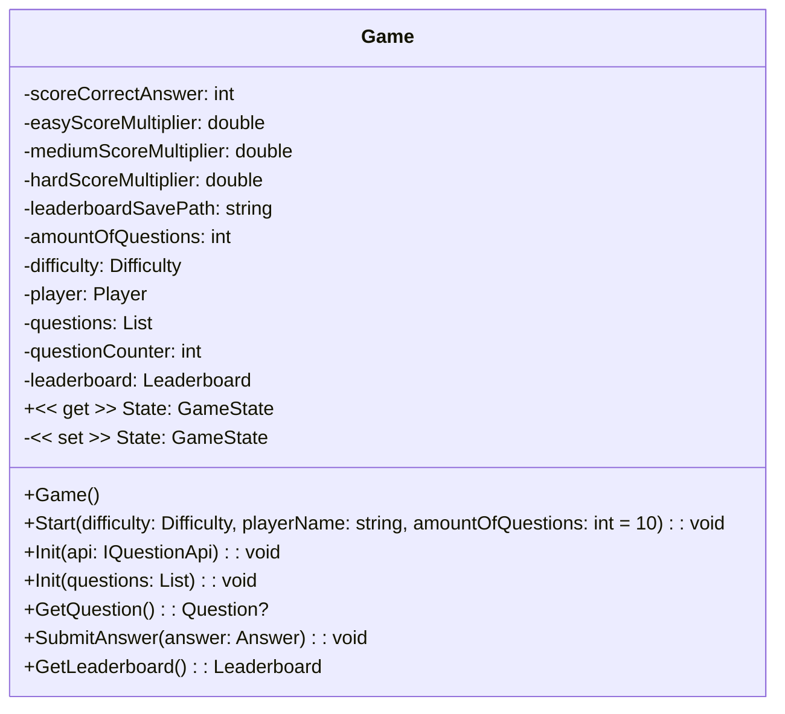

### 3.2 Question Class

The Question class is responsible for the question logic.
It contains the question and the possible answers.

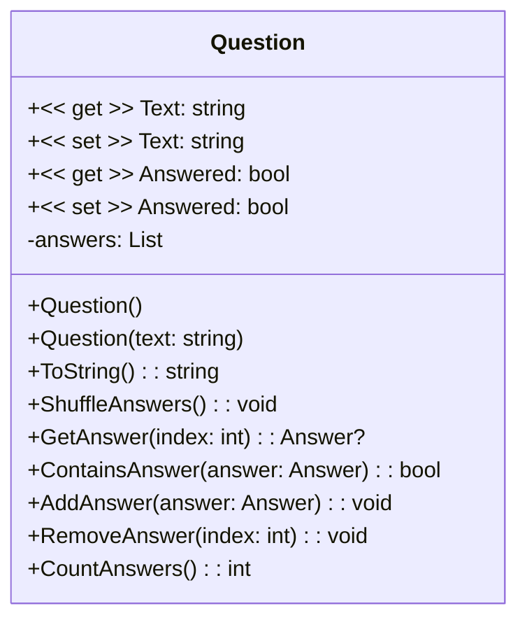

### 3.3 Answer Class

The Answer class is responsible for the answer logic.
It contains the answer text and if it is the correct answer.

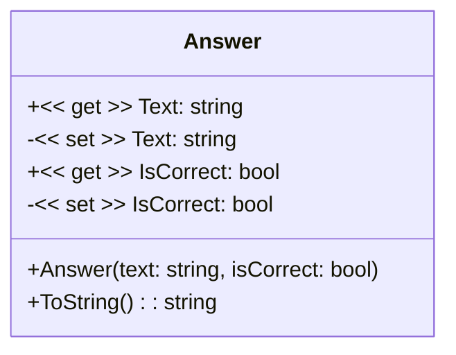

### 3.4 Player Class

The Player class is responsible for the player data.
It contains the player name and score.

**Note:** As noted in the ConsoleApp, the Name and Score properties should not be used directly.
Instead, use the ChangeName, AddScore, RemoveScore and ResetScore methods.

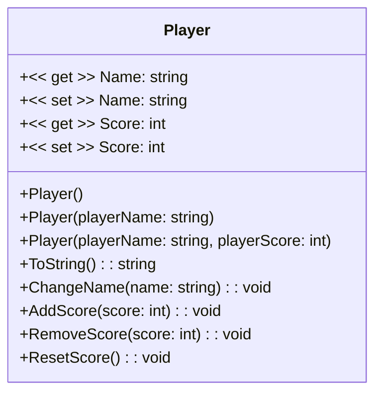

### 3.5 Leaderboard Class

The Leaderboard class is responsible for the leaderboard data.
It contains a list of players.

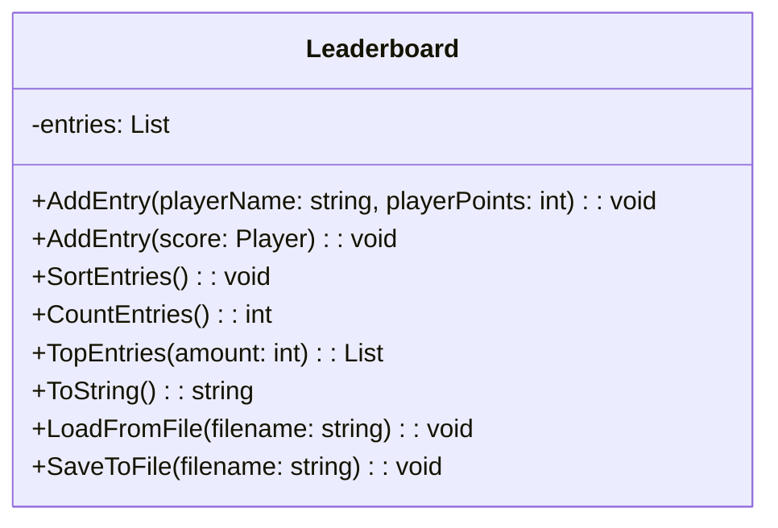

### 3.6 IQuestionApi Interface

The IQuestionApi interface can be used to get questions from an API.
This interface is used in the `Game` class and can be given as an argument with the Init method.

The interface expects a `GetRandomQuestion` method that returns a `Task` with a `Question` and a `Difficulty` as arguments.

### 3.7 Difficulty Enum

The Difficulty enumeration is used to set the difficulty of the game.
It has the following values:

- easy
- medium
- hard

### 3.8 GameState Enum

The GameState enumeration is used to set the state of the game.
It has the following values:

- unkown (default value)
- uninitialized (the game is not initialized)
- initialized (the game is initialized)
- ended (the game is ended)

## 4. TriviaApiLibrary

The trivia api library is responsible for getting questions from the [trivia api](https://the-trivia-api.com).
The original source code can be found [here](https://github.com/BioBoost/csharp-trivia-questions-api).
This library adds 2 new classes to the original source code:

- TriviaApi
- TriviaQuestionConverter

### 4.1 TriviaApi Class

The TriviaApi class is responsible for getting questions from the trivia api.
This class implements the `IQuestionApi` interface from the GameLibrary.

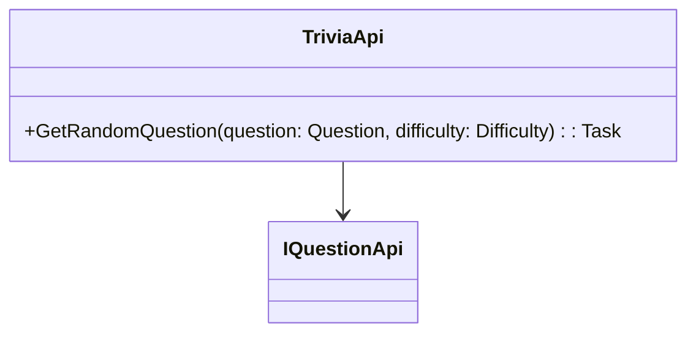

### 4.2 TriviaQuestionConverter Class

The TriviaQuestionConverter class is responsible for convetring the questions from the trivia api to questions that can be used in the game.
This class is used in the TriviaApi class to convert the api questions to game questions.

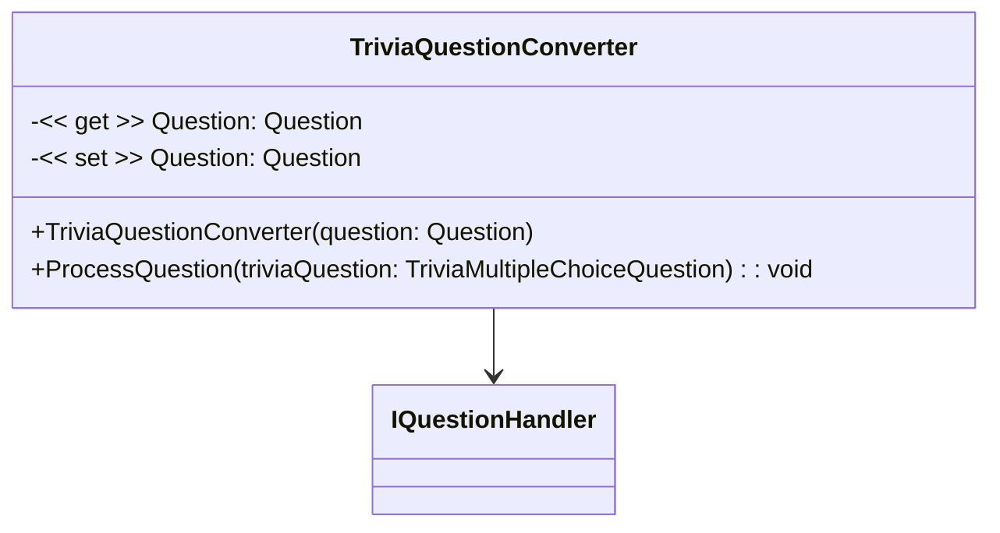

## 5. ConsoleApp

The console application is a demo application that uses the game library.
It contains examples of how to use the different classes of the game library.

## 6. QuestionnaireApp

The questionnaire application is a WPF application that uses the game library.
It contains a questionnaire game, where the player has to answer questions.
The player can input his/her name and choose the difficulty of the game.
After the game, the player can see the leaderboard, which is saved in a file.

### 6.1 Features

The questionnaire app has the following features:

- The player can input his/her name
- The player can choose the difficulty of the game
- There is a loading screen while the game is loading the questions
- When the player answers a question, he/she can see if the answer was correct and what the correct answer was
- There is a wait duration between questions depending on the length of the correct answer (only if answered incorrectly), so the player can read the correct answer
- The player can see the leaderboard after the game is finished
- The leaderboard is saved in a file
- The player score is calculated by the amount of correct answers and the difficulty of the game
- There is a progress bar that shows the progress of the game (how many questions are answered)

### 6.2 Screenshots

#### Main Menu

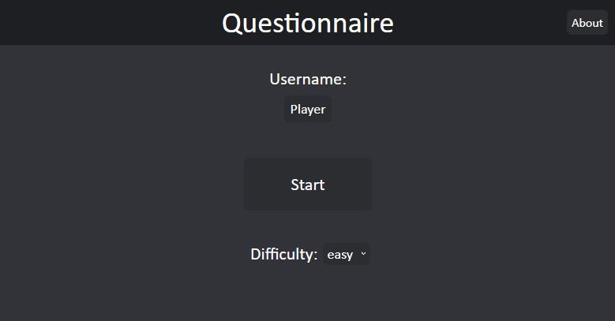

#### Loading Screen

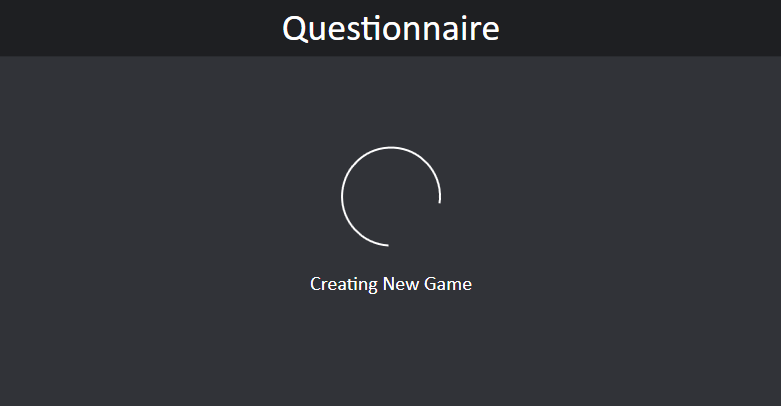

#### Question

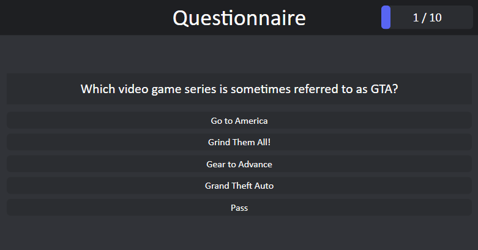

#### Answered Question

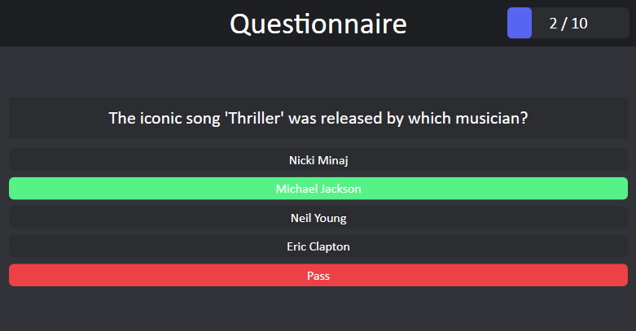

#### Leaderboard

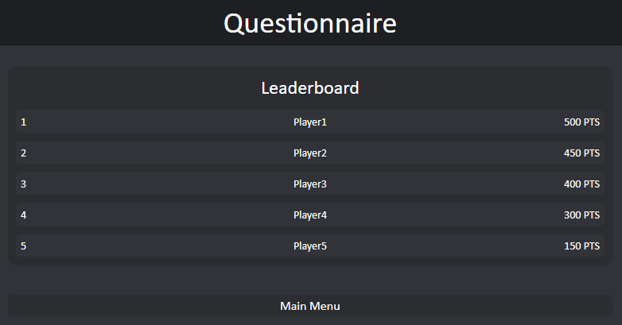

#### About

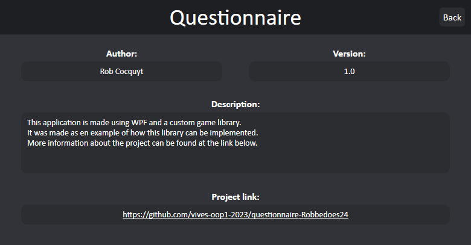

## 7. Future Improvements

The following improvements can be made to the project:

- Redesign the Main Menu (i don't like the current design)
- Add a settings menu (where the player can change game settings, like the leaderboard save path, amount of questions, reset the leaderboard, catagories, ...)
- Highlight the score in the leaderboard
- Show the player score in the leaderboard even if the player is not in the top 5
- Add a timer to the questions (optional, not everyone likes this)
- Add sound to the game
- Let someone check my code and give feedback (i'm not sure if i did everything correctly)
- Remove the `Pass` answer from the answers list (i'm not sure if this was a good idea)
- Add more api's to get questions from (maybe an option for a custom api or a local file)
